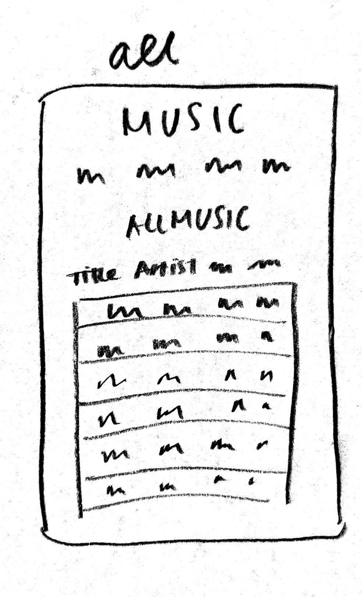

# My Design Journey

### Describe your Catalog
> What will your collection be about? What types of attributes will you keep track of for the *things* in your catalog? 1-2 sentences.

- My catalog will be a music catalog, consisting of the song name, album art(possibly but making sure it doesn't verge on the category of an image gallery), artist, music category, ratings, and an indicator if its new music. The user will be able to sort though and display the songs based solely on the artist, or the album, or the rating rankings.

### Target Audience(s)
> Tell us about your target audience(s).

- My target audience consists of people who like to listen to music and are looking to find new music. They are young, trendy people who care about popular trends in the music industry and finding new songs that others are currently into.

### Design Patterns
> Review some existing catalog that are similar to yours. List the catalog's you reviewed here. Write a small reflection on how you might use the design patterns you identified in your review in your own catalog.

1. Billboard
- This music catalog has a robust selection of content, ranging from top charts to news to music sorted by genre. The charts themselves are also sorted by Top Charts, Greatest of All Time and by different genres. The layout is slightly confusing, because they have two Top Charts, the Hot 100 and the Billboard 200, at the very top of the page, with a section for industry charts in the middle that the user can view in a grid format. Then, at the bottom of the page, they have another drop down style bar, that lists all of the charts in one. A more natural layout would be to have the drop down style navigation bar at the top of the page, with the grid format pictures within the menu, so that users can clearly identify which charts are in which category. However, this drop down style menu is a very clear-cut way of showing all of the charts.

2. Discogs
- This music catalog is a very detailed, robust catalog with multiple selections of search queries and content. On Discogs, users can find new music through the Explore tab, specifically within the Discover section, the Genre section where users can find new music based on genre, and the Styles section where the content is somewhat different from the Genres. This is tab is slightly confusing, because it has the Contribute section right in between the Discover and Genre links. It also has the Genre and Style headers, which are confusing to differentiate. Within the Discover header, they also have "Articles About Music" which seems a little out of place when all of the other links are about exploring music, not written articles. However, on the Discover page, it is very helpful to see the number of songs they have in each category, such as by Genre, by Format, and by Country.

3. Collector's Choice Music
- This music catalog is very thoroughly illustrated, with multiple graphics to emulate an old timey radio. This catalog is very hard to navigate, because of the different graphics and the color scheme. The old radio style buttons make it increasingly difficult to navigate between the search categories. Similarly, the search text box itself is hard to see and difficult to determine where the user should input information, because the text box itself is the same color and the background, making it seem like one button.

4. Spotify
- This music catalog is very broad in its offerings. When considering the home page itself, the layout is very visual, focusing mainly on the album and playlist photos. The ordering of the playlist categories are very natural and intriguing, starting off with the Recently Played playlists and albums so users can easily reference them, and then Your Heavy Rotation playlists and albums for easy reference again, then a Made for You category for users to explore new music. However, becuase the home page is a series of playlist cagegories and their cover photographs, it can be slightly intimidating and hard to scroll through. Breaking up the material slightly would make it easier for the user to take in. But, it is also nice that the side bar is static during the scroll, so that the user can always reference other tabs in the window regardless of where they are in the page.

My Own Page
- For my own page, I want to integrate the user-friendly qualities of these 4 catalogs I reviewed. From the Billboard website, I want to mimic the side bar design they utilize, which lists all of the possible categories the music content can be sorted into. From the Discogs website, I want to utilize their count design, where they display the number of songs that are in each category. From the Collector's Choice Music, I want to take away the importance of color schemes and color contrasts when creating my text boxes and category descriptions. From Spotify, I want to take away the usefulness of having categories and content sorted for you, aligning with the user preferences, and the easy navigation of having a static side bar. From all of these pages, I learned the importance of having a natural color scheme with proper color contrast, and making sure that the content flows naturally from the top of the page to the bottom of the page, with breaks in between that make sense.

## Design & Planning

## Design Process
> Document your design process. Show us the evolution of your design from your first idea (sketch) to design you wish to implement (sketch). Show us the process you used to organize content and plan the navigation, if applicable.
> Label all images. All labels must be visible in VS Code's Markdown Preview.
> Clearly label the final design.

Navigation Key Word Iteration
- 

Search By/Filter By Brainstorming
- 

First Design
- 

Second Design
- 

After experimenting with different website styles with all of the content on page, I decided that it would make more sense for my site to have multiple pages.

First Iteration of Search Page

Second Iteration of Search Page

Third Iteration of Search Page

Fourth Iteration of Search Page

When making my search page, at first I was looking to differentiate between different fields like titles, artists, and by genre. However, for my target audience, I realized that it would make more sense to have one search bar that searched across multiple fields. Sometimes titles have the names of artists in them and perhaps one artist can span multiple genres in their songs. Similarly, I thought it would be easier to have one search bar to make it easier for the audience to search for a wider range of songs. After all, the purpose of this music catalog is to educate people and bring exposure to songs that they otherwise may not have encountered!

Final Iteration of Search Page

First Iteration of Search Results Page (this was before I decided on the single search bar)

Final Iteration of Search Results Page

Final Iteration of All music Page

Final Iteration of New Releases Page

Final Iteration of Contribute Page

Final Iteration of Contribution Confirmation Page

